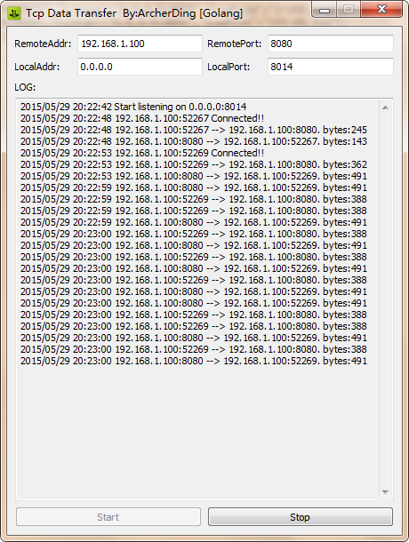

# DataTransfer

端口映射的作用是使不在同一网络的客户端与服务端,可以通过中间服务进行通信.



安装方法:

> 为依赖库追加函数github.com/lxn/walk/blob/master/icon.go

```
func NewIconFromResourceId(resId uintptr) (ic *Icon, err error) {
	hInst := win.GetModuleHandle(nil)
	if hInst == 0 {
		err = lastError("GetModuleHandle")
		return
	}
	if hIcon := win.LoadIcon(hInst, win.MAKEINTRESOURCE(resId)); hIcon == 0 {
		err = lastError("LoadIcon")
	} else {
		ic = &Icon{hIcon: hIcon}
	}
	return
}
```

1. 执行`go get github.com/akavel/rsrc`,安装资源打包工具

2. 执行`go get github.com/ArcherDing/DataTransfer`,下载源码

3. `cd %GOPATH%/src/github.com/ArcherDing/DataTransfer`

4. `./make.bat`

使用方法:

1. 在中间机器上运行本程序,并配置监听端口与目标地址

